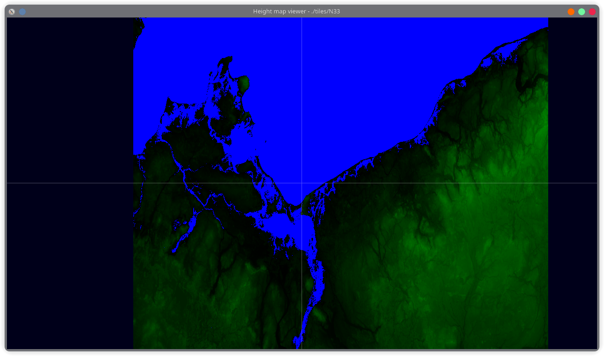
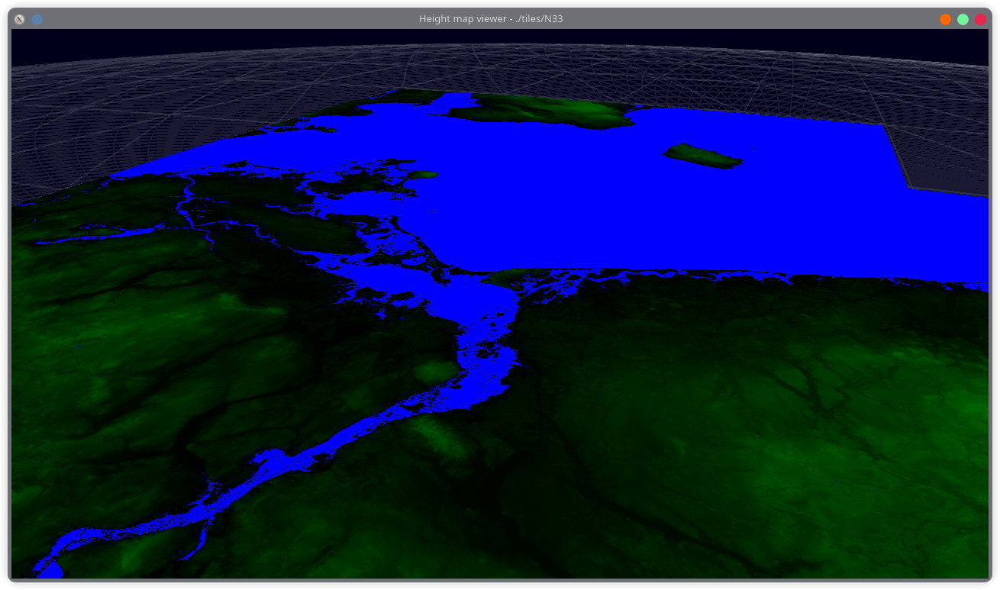
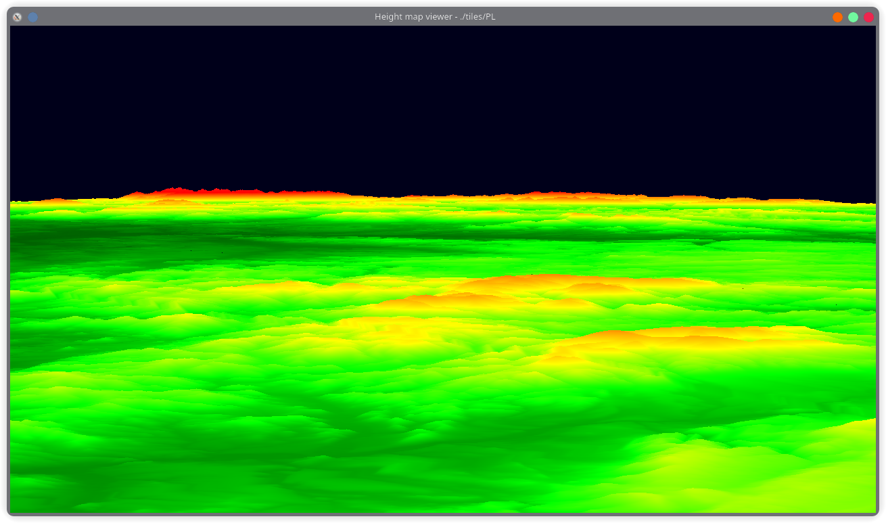
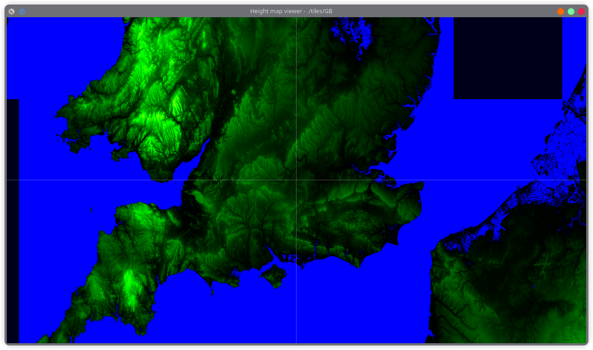
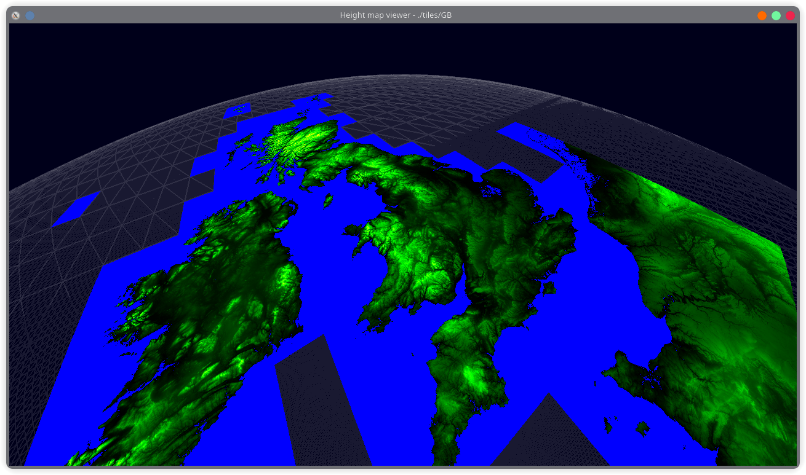
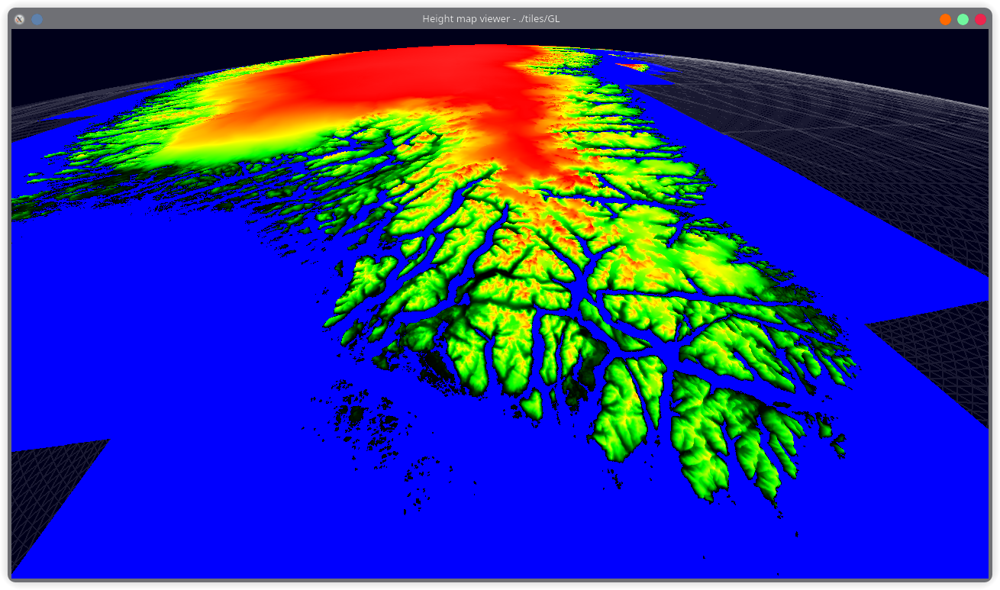
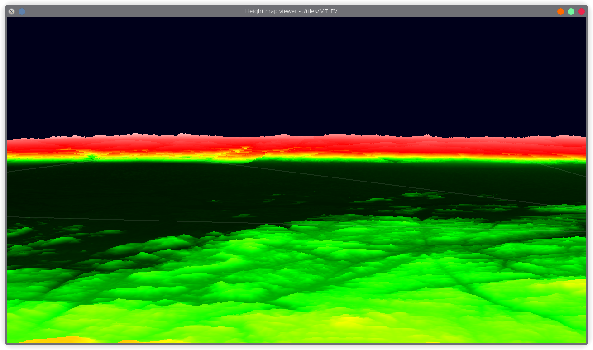

# Height map viewer

This program can be used to visualize height maps downloaded e.g. from [this site](https://www.viewfinderpanoramas.org/Coverage%20map%20viewfinderpanoramas_org3.htm).

Tested with clang++ 18.1.6.

## Building

Run
```sh
make
```

To clean:
```sh
make clean
```

## Usage

```sh
./main <path/to/hgt/files>... [-lon <x1> <x2>] [-lat <y1> <y2>] [-start <lon> <lat> <alt>]
```

You must specify at least one path, which could contain directly the `.hgt` files or directories containing them, etc.

Coordinates are given in degrees.
- `-lon` and `-lat` specify the range of the loaded tiles, out of the ones in the specified directory.
- `-start` specifies the starting position of the camera.

Altitude is given in kilometers above sea level.\
The order of the arguments does not matter.

The program will recursively look for `.hgt` files in the given directories, matching any given limits (`-lat`/`-lon`, if given), and load their data, assuming each of the files contains 1201 * 1201 encoded integers.

Tiles will be loaded asynchronously on a separate thread.

After successful initialization:
- the crosshair should be visible,
- drawing rate, FPS and current 2D coordinates should be printed in the terminal.

### Controls

The map starts in 2D mode. Switch between 2D and 3D with <kbd>Tab</kbd>.

#### 2D
- Mouse up/down/left/right - move north/south/west/east
- Mouse wheel up/down - zoom in/out
- <kbd>Shift</kbd> - move slower

#### 3D
- <kbd>W</kbd>/<kbd>S</kbd>/<kbd>A</kbd>/<kbd>D</kbd> - move forward/backward/left/right
- Mouse - look around
- Mouse wheel up/down - zoom in/out (FOV)
- <kbd>Ctrl</kbd>/<kbd>Space</kbd> - descend/ascend
- <kbd>Shift</kbd>:
  - move faster
  - look around slower

The level of detail (LOD) can be changed with the number keys:
- <kbd>1</kbd> - Native
- <kbd>2</kbd>
- ...
- <kbd>7</kbd>
- <kbd>8</kbd> - Worst
- <kbd>0</kbd> - Auto (will adjust each tile's LOD based on distance)

Press <kbd>Q</kbd> to recompile shaders for the crosshair, grid and tiles.

## Screenshots







